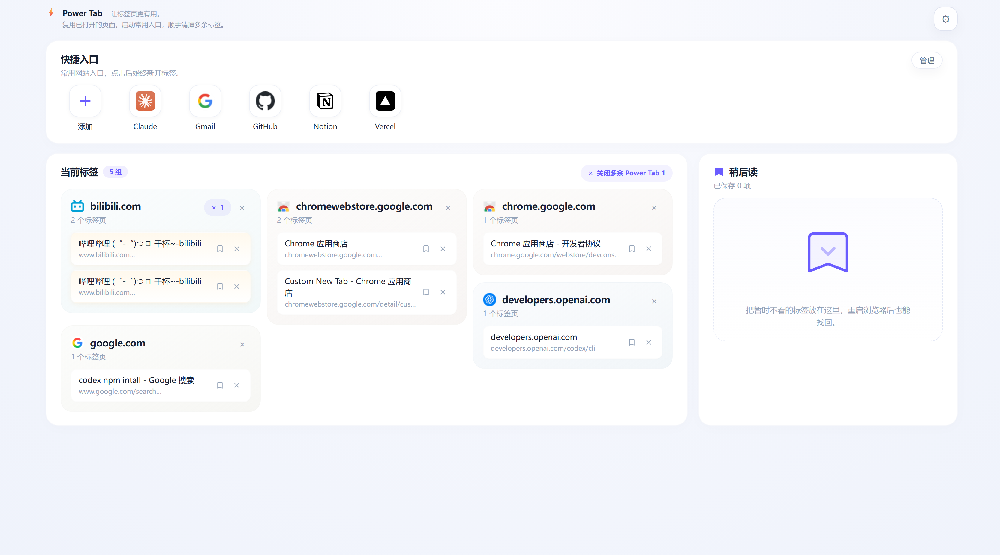

# Power Tab

[中文说明 / Chinese README](./README.zh-CN.md)



Power Tab is a Chrome extension that turns the new tab page into a practical tab workspace.

It helps you reuse, switch, clean up, and reopen the pages you already work with, without turning the browser into a heavy workspace system.

## What It Does

- Prefer reusing open tabs before creating duplicates.
- Group open tabs by site and keep homepage-like tabs easier to spot.
- Close individual tabs, close whole groups, close duplicate tabs, and clear extra Power Tab pages.
- Save tabs to Read Later and remove them when they are no longer needed.
- Keep custom Quick Apps for frequently used sites.
- Manage Quick Apps with a dedicated management mode: add, edit, delete, and drag to reorder.
- Trigger a compact Quick Tab Switcher overlay from a keyboard shortcut.
- Switch tabs with keyboard navigation, search filtering, previous-tab return, and inline tab closing.
- Cache favicons locally for more stable icon rendering.
- Configure language, visual style, and Quick Tab Switcher behavior.

## Product Model

Power Tab is built around a simple workflow:

- **Reuse first**: matching open tabs are prioritized to reduce duplicate pages.
- **Launch intentionally**: Quick Apps always open a new tab and act like a lightweight app launcher.
- **Clean continuously**: open tabs are grouped so cleanup is low-friction.
- **Switch without context loss**: Quick Tab Switcher appears over the current page and keeps focus on fast tab selection.

## Core Areas

### New Tab Workspace

The new tab page includes:

- Quick Apps,
- grouped open tabs,
- duplicate cleanup actions,
- Read Later,
- settings.

### Quick Apps

Quick Apps are custom shortcuts for sites you open often.

They support:

- add/edit/delete,
- favicon or fallback icon rendering,
- drag-and-drop ordering,
- a management mode to keep normal browsing clean,
- persistent local storage.

Power Tab no longer ships with default Quick Apps. New installs start empty.

### Open Tab Management

Open tabs are shown by site so you can quickly scan and clean up:

- focus an existing tab,
- close one tab,
- close a whole group,
- close duplicates,
- close extra Power Tab pages.

### Read Later

Read Later stores tabs locally so you can revisit them after closing them from the active tab set.

### Quick Tab Switcher

The Quick Tab Switcher is a keyboard-driven overlay for the current window.

It supports:

- search by title, domain, or URL,
- arrow key and Tab navigation,
- Enter to focus the highlighted tab,
- Shift+Enter to return to the previous tab,
- inline tab close,
- fixed-size overlay with internal scrolling,
- scroll containment so the page behind it does not move.

## Storage

Power Tab uses `chrome.storage.local` for user data:

- Quick Apps,
- Read Later items,
- favicon cache,
- settings.

This data survives browser restarts, extension reloads, and extension updates. It is removed when the extension is uninstalled.

## Inspiration

Power Tab is inspired in part by **@张咋啦（Zara）** and the **tab-out** project:

- https://github.com/zarazhangrui/tab-out

That influence is most visible in the keyboard-first tab switching direction. Power Tab extends it into a broader new-tab workflow shaped by everyday browsing habits.

## Tech Stack

- Vue 3
- TypeScript
- Vite
- Chrome Extension Manifest V3
- pnpm

## Development

Install dependencies:

```bash
pnpm install
```

Run checks:

```bash
pnpm typecheck
pnpm test
```

Build the extension:

```bash
pnpm build
```

Load in Chrome:

1. Open `chrome://extensions`
2. Enable Developer Mode
3. Click **Load unpacked**
4. Select the generated `dist` directory

During development, prefer reloading the unpacked extension instead of uninstalling it. Uninstalling clears `chrome.storage.local` data.

## Useful Scripts

```bash
pnpm build
pnpm typecheck
pnpm test
pnpm version-sync
```

`pnpm build` runs `version-sync` first, keeping `public/manifest.json` aligned with `package.json`.

## Status

Power Tab is still personal/early-stage software, but the core workflow is usable:

- new tab workspace,
- open-tab reuse,
- Quick Apps,
- Read Later,
- Quick Tab Switcher,
- settings and local persistence.

## License

MIT
